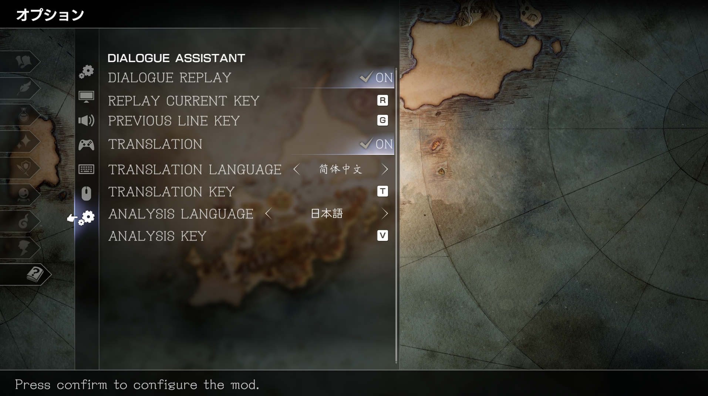

# Octopath Dialogue Assistant

[简体中文](README.md) | English

A dialogue-focused language-learning mod for *OCTOPATH TRAVELER II*. It includes:

- **Replay current line**: Replays the current dialogue box, original voice, camera, and character performance. The default key is `R`.
- **Previous line**: Replays the complete performance for the previous line, then returns to the current story position. The default key is `G`.
- **Official translation**: Displays the game's official text for the current story line, ordinary NPC dialogue, Party Chat line, or completed Inquire/Scrutinize profile. The key is configurable and defaults to `T`; the default translation language is Simplified Chinese.
- **Language analysis**: Displays vocabulary, readings, parts of speech, and grammar for the current Japanese story, NPC dialogue, or Party Chat line. The key is configurable and defaults to `V`; the default analysis language is Japanese. The profile screen is connected to the same analysis interface and shows a no-data message until profile analysis data is added.
- **Narration/note pages**: Supports translation and analysis, numbered in the current page's paragraph order. Hints and panels use a separate full-screen foreground layer, outside the narration canvas's clipping. Use `Up` / `Down` to scroll open panels. Pages update automatically, and the foreground layer is removed when the page closes; narration does not participate in story replay.
- **Key hints**: Shows all four shortcuts for lines bound to a story sequence, and the translation/analysis shortcuts for ordinary NPC dialogue, Party Chat, narration/notes, and Inquire/Scrutinize profiles.
- **Configuration**: Adds a configuration category to the in-game Options menu for feature toggles, shortcut keys, translation language, and analysis language.

Translation and analysis identify lines by their complete source text, including lines whose voice and text IDs differ; original-voice replay is unchanged. Dialogue lookup data is prepared in small batches after startup rather than loaded all at once on a keypress. Opening a panel early shows a preparation message, then automatically displays the current line when ready. Advancing dialogue, changing languages, and closing panels still work during preparation.


## In-Game Mod Settings

Open the game's Options menu and select the `DIALOGUE ASSISTANT` category with the native-style icon. The mod creates eight settings in the right-hand list:

- `DIALOGUE REPLAY`: Use Left/Right or Confirm to enable or disable replay and previous-line playback.
- `REPLAY CURRENT KEY`: Confirm the item, then press any letter to assign the replay-current shortcut.
- `PREVIOUS LINE KEY`: Confirm the item, then press any letter to assign the previous-line shortcut.
- `TRANSLATION`: Use Left/Right or Confirm to enable or disable official translations.
- `TRANSLATION LANGUAGE`: Use Left/Right to select the translation language.
- `TRANSLATION KEY`: Confirm the item, then press any letter to assign the show/hide translation shortcut.
- `ANALYSIS LANGUAGE`: Use Left/Right to select the language to analyze.
- `ANALYSIS KEY`: Confirm the item, then press any letter to assign the show/hide analysis shortcut. It is currently available only when the analysis language is Japanese.

The translation and analysis language selectors use the same nine-language list as the game's native `Text Language` setting: Japanese, English, Italian, French, German, Spanish, Traditional Chinese, Simplified Chinese, and Korean. Only Japanese analysis data is currently included. Selecting another analysis language disables `ANALYSIS KEY`, its shortcut hint, and the analysis action.



## Supported Version

- Steam App `1971650`
- Analyzed build `13399590`
- Unreal Engine `4.27.2`
- Executable SHA256: `409648E864CEEC5CA0E57A493B39D808B54BEF1E183C674F7F40CEDEDACFDBCF`
- UE4SS `3.0.1`

## Install or Update

Download `OctopathDialogueAssistant-<version>.zip` from [Releases](https://github.com/laigus/Octopath_Traveler2_DialogueAssistantMod/releases/latest). The package includes the pinned UE4SS 3.0.1 runtime, official text lookup data for all nine languages, and Japanese analysis data. Extract the complete archive, exit the game, and double-click `OctopathDialogueAssistantInstaller.exe` inside it:

1. The installer restores the last valid game folder first. On first use, or if that folder no longer exists, it searches Steam and its additional libraries. One match is filled in automatically; multiple matches appear in the dropdown. If none is found, click `选择目录` (Select Folder) and choose `Octopath_Traveler2` under Steam's `common` directory.
2. Click `安装 / 更新` (Install / Update).
3. Start the game after the window reports `安装完成` (Installation Complete).

Valid folders are remembered in the current Windows user's registry, so the choice survives moving the installer or extracting a new package. You can always change the folder manually. Detection does not start installation; installation still checks that the game is closed and the build is supported.

You can also install from the extracted package root with PowerShell:

```powershell
powershell -ExecutionPolicy Bypass -File scripts\install.ps1 -GameRoot "<Octopath_Traveler2 folder under Steam common>"
```

The installer adds the pinned UE4SS files, `Mods\OctopathDialogueAssistant`, and the enable line in `mods.txt` under `Binaries\Win64`. It also copies `OctopathDialogueAssistant_P.pak` to the game's `Content\Paks` directory. The nine official text lookup files and the read-only `analysis_ja.tsv` are installed with the mod. The separate override PAK adds the Options category and supplements the Simplified Chinese font used by the analysis panel with Japanese glyphs. It leaves the game's main PAK, executable, and save data unchanged. Updates preserve the user's `config.lua`; uninstalling removes the mod PAK, runtime code, and lookup data.

The runtime log is located at `Binaries\Win64\UE4SS.log` inside the game directory.

## Uninstall

Exit the game, open `OctopathDialogueAssistantInstaller.exe`, confirm the automatically filled or manually selected game directory, and click `卸载` (Uninstall). You can also run:

```powershell
powershell -ExecutionPolicy Bypass -File scripts\uninstall.ps1 -GameRoot "<Octopath_Traveler2 folder under Steam common>"
```

The uninstaller reads the mod's installation manifest and restores the pre-installation state. Files added by this installation, including the mod PAK and UE4SS, are removed. Matching pre-existing files are retained, while updated files are restored from the installation backup.

The TSV files, PAK, UE4SS archive, and graphical installer in the source workspace are generated artifacts excluded from Git. Developers can find the complete generation and release workflow in [Architecture](https://github.com/laigus/Octopath_Traveler2_DialogueAssistantMod/blob/main/docs/architecture.md). For confirmed game objects and behavior, see [Research Notes](https://github.com/laigus/Octopath_Traveler2_DialogueAssistantMod/blob/main/docs/research.md). Both documents are currently written in Chinese.
