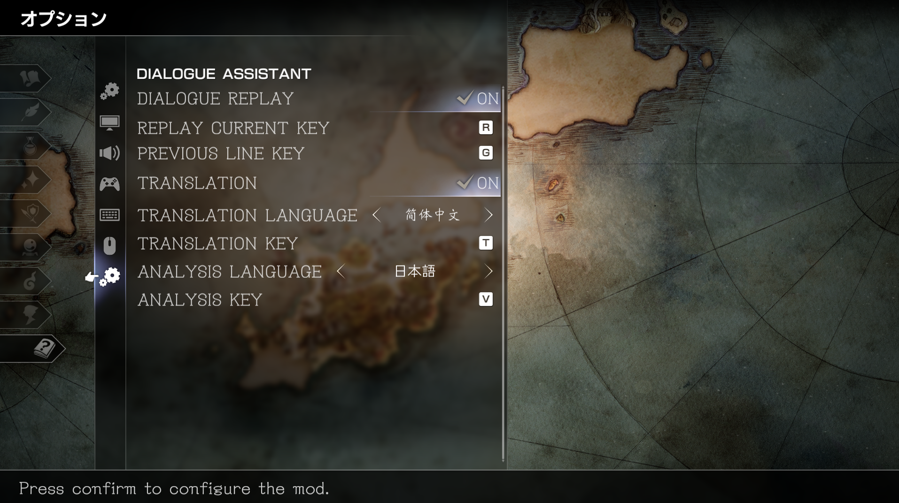

# Octopath Dialogue Assistant

简体中文 | [English](README.en.md)

《八方旅人 II》的台词语言学习 Mod，包含：

- **重播本句**：重新播放当前台词对应的对话框、原声、镜头和角色演出。默认按 `R` 。
- **上一句话**：回看上一句的完整演出片段，然后返回原剧情位置继续。默认按 `G` 。
- **官方翻译**：用可配置按键在剧情右上角显示当前台词对应的游戏官方文本；默认按 `T` 。默认为简体中文。
- **语言解析**：用可配置按键显示当前日语台词的词汇、读音、词性和语法；默认按 `V`。默认为日文。
- **提示**：剧情角落有快捷键提示；
- **配置**：游戏“设置”页提供 Mod 配置入口。可修改功能开关，快捷键，翻译语言，解析语言。


## 游戏内 Mod 设置

打开游戏的“设置”菜单，左侧分类栏会出现一个使用原生图标的 `DIALOGUE ASSISTANT` 分类。该分类的设置项由 Mod 独立建立；右侧列表包含八项：

- `DIALOGUE REPLAY`：按左右键或确认键切换重播与回退的总开关；
- `REPLAY CURRENT KEY`：确认后按任意字母保存“重播本句”按键；
- `PREVIOUS LINE KEY`：确认后按任意字母保存“上一句话”按键；
- `TRANSLATION`：按左右键或确认键切换官方翻译功能；
- `TRANSLATION LANGUAGE`：按左右键选择翻译语言；
- `TRANSLATION KEY`：确认后按任意字母保存“显示/隐藏翻译”按键；
- `ANALYSIS LANGUAGE`：按左右键选择待解析语言；
- `ANALYSIS KEY`：确认后按任意字母保存“显示/隐藏解析”按键，目前仅在分析语言为日语时可用。



翻译语言和分析语言都使用游戏原生 `Text Language` 的九项列表，包含日语、英语、意大利语、法语、德语、西班牙语、繁体中文、简体中文和韩语。当前只有日语解析数据；分析语言选择其他项时，`ANALYSIS KEY` 置灰且解析快捷键提示和功能停用。

## 支持对象

- Steam App `1971650`
- 已分析 build `13399590`
- Unreal Engine `4.27.2`
- 主程序 SHA256：`409648E864CEEC5CA0E57A493B39D808B54BEF1E183C674F7F40CEDEDACFDBCF`
- UE4SS `3.0.1`

## 安装或更新

从 [Releases](https://github.com/laigus/Octopath_Traveler2_DialogueAssistantMod/releases/latest) 下载 `OctopathDialogueAssistant-<版本>.zip`。安装包已经包含固定版本的 UE4SS 3.0.1、九种官方文本查询文件和日语解析数据。完整解压压缩包，退出游戏后双击其中的 `OctopathDialogueAssistantInstaller.exe`：

1. 点击“选择目录”，选择 Steam `common` 下的 `Octopath_Traveler2` 文件夹；
2. 点击“安装 / 更新”；
3. 窗口显示“安装完成”后启动游戏。

也可以在解压后的安装包根目录运行命令行安装：

```powershell
powershell -ExecutionPolicy Bypass -File scripts\install.ps1 -GameRoot "<Steam common 下的 Octopath_Traveler2 目录>"
```

安装会向 `Binaries\Win64` 添加固定哈希的 UE4SS 文件、`Mods\OctopathDialogueAssistant` 和 `mods.txt` 启用行，并把 `OctopathDialogueAssistant_P.pak` 放入游戏的 `Content\Paks`。九种官方文本查询文件和只读的 `analysis_ja.tsv` 随 Mod 安装。独立覆盖 PAK 扩展设置页分类，并为解析框使用的简体中文字体补充日文字形；它不改写游戏主 PAK、EXE 或存档。更新时保留用户的 `config.lua`；卸载时一并移除 Mod PAK、运行时代码与查询文件。

运行日志位于游戏目录的 `Binaries\Win64\UE4SS.log`。

## 卸载

退出游戏后打开 `OctopathDialogueAssistantInstaller.exe`，选择相同的游戏目录并点击“卸载”。也可以运行：

```powershell
powershell -ExecutionPolicy Bypass -File scripts\uninstall.ps1 -GameRoot "<Steam common 下的 Octopath_Traveler2 目录>"
```

卸载会读取 Mod 内的安装状态并恢复安装前内容：本次新增的 Mod PAK 与 UE4SS 会一并移除，安装前已经存在且哈希相同的文件会保留，被更新的文件从安装时备份恢复。

源码仓库中的 TSV、PAK、UE4SS 压缩包和图形安装器都是 Git 忽略的生成内容；开发者的完整生成与发布流程见 [架构](https://github.com/laigus/Octopath_Traveler2_DialogueAssistantMod/blob/main/docs/architecture.md)。已确认的游戏对象见 [研究记录](https://github.com/laigus/Octopath_Traveler2_DialogueAssistantMod/blob/main/docs/research.md)。
